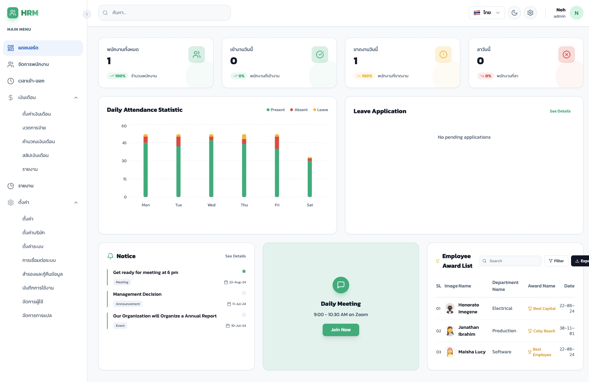
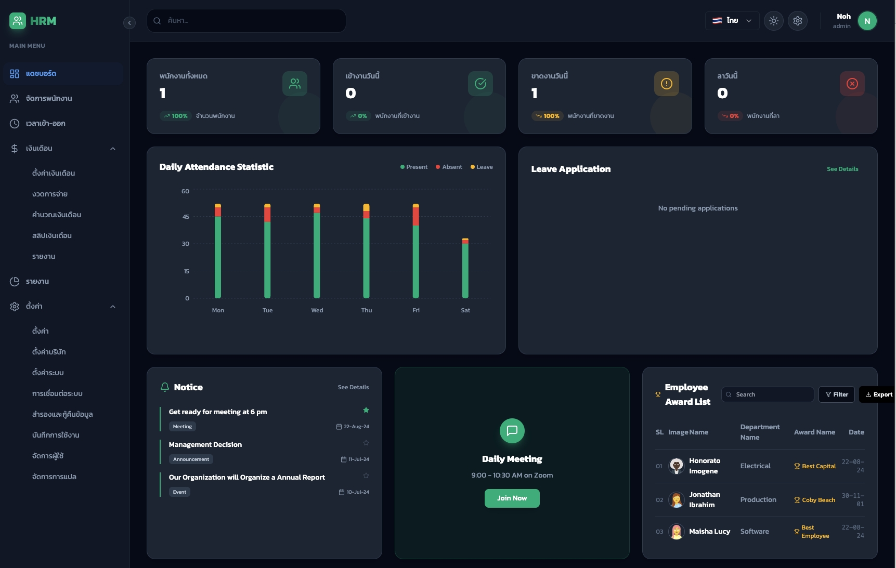
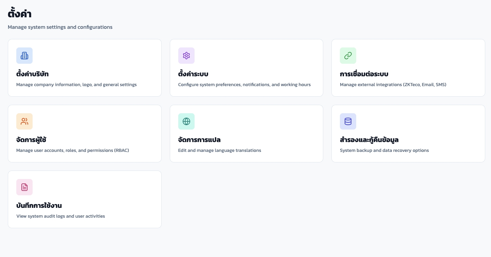
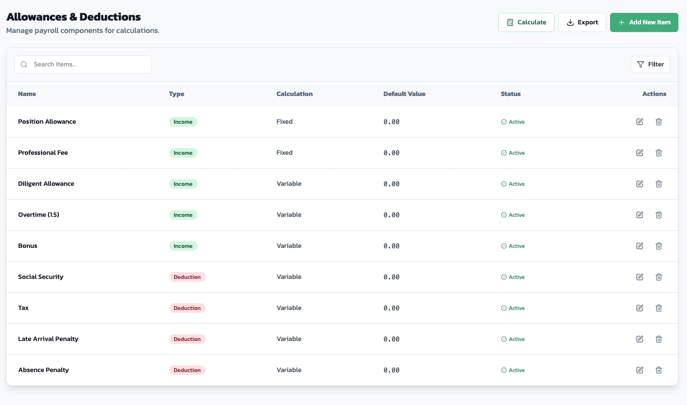
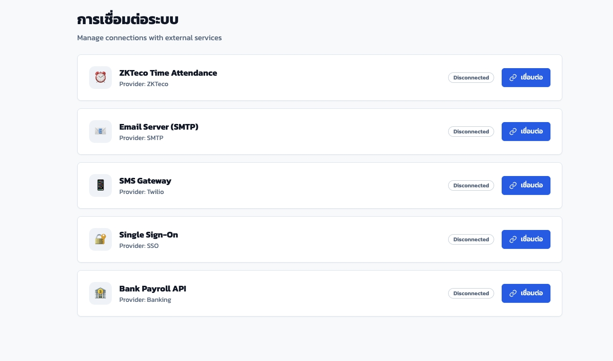

# HRM System

แพลตฟอร์มบริหารทรัพยากรบุคคลที่รวมงานหลักไว้ครบในที่เดียว — ตั้งแต่ข้อมูลพนักงาน เวลาเข้างาน ไปจนถึงการตั้งค่าระบบและการตรวจสอบย้อนหลัง

## จุดเด่น
- Dashboard แบบสรุปภาพรวม พร้อมกราฟและตัวชี้วัดสำคัญ
- จัดการพนักงาน/ผู้ใช้/สิทธิ์การเข้าถึงอย่างเป็นระบบ
- Time & Attendance พร้อมบันทึก/ติดตามสถานะการทำงาน
- Payroll และองค์ประกอบที่เกี่ยวข้อง (เช่น Allowance/Deduction, Periods)
- Audit Log และ Settings สำหรับการควบคุมและตรวจสอบ
- รองรับหลายภาษา (TH/EN) ผ่าน i18next

## ตัวอย่างหน้าจอ
> วางภาพไว้ที่ `/images` จำนวน 4 รูปตามชื่อไฟล์ด้านล่าง







## เทคโนโลยีที่ใช้
- React 18 + Vite
- Tailwind CSS + Radix UI
- Supabase (Auth, Database, Storage)
- i18next, Recharts, framer-motion

## เริ่มต้นใช้งาน
```bash
npm install
npm run dev
```
จากนั้นเปิด `http://localhost:3000`

## การตั้งค่า Supabase
ค่าเชื่อมต่อถูกกำหนดไว้ใน `src/lib/customSupabaseClient.js`  
หากต้องการเปลี่ยนโปรเจกต์/คีย์ ให้แก้ไขไฟล์ดังกล่าว

## คำสั่งที่มี
```bash
npm run dev      # run dev server
npm run build    # build production
npm run preview  # preview build
```

## โครงสร้างโปรเจกต์ (ย่อ)
- `src/pages` หน้าจอหลัก
- `src/components` คอมโพเนนต์ UI
- `src/services` การเชื่อมต่อ Supabase และบริการข้อมูล
- `src/contexts` Context และ Auth

